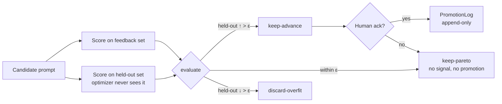

# verification-spine

**A minimal held-out promotion gate for self-improving prompts and agents. Your optimizer will overfit — this is the part that says no.**

[](https://github.com/vince-ni/verification-spine/actions/workflows/ci.yml)
[](https://www.python.org)
[](LICENSE)

If you iterate on prompts by re-running the same examples and watching the score go up, the score will go up — that is what optimizing against a fixed set *does*, and it tells you nothing about whether the prompt got better at the job. This library is the verdict logic extracted from a personal agent system that runs a real business: **disjoint held-out scoring, a noise floor, verdicts instead of scores, and promotion that requires a human**.



## The incident this comes from

On June 9, 2026, the originating system's prompt-evolution loop produced a candidate that scored *higher* on its training objective and *worse* on held-out. The gate discarded it automatically. Verbatim fitness values from the run log:

| Round | Verdict | Train | Held-out |
|---|---|---|---|
| 0 (baseline) | — | 0.349 | 0.318 |
| 1 | keep-advance | 0.821 | 0.727 |
| 2 | **discard-overfit** | 0.825 | **0.682** |

Round 2's training "gain" (+0.004) was inside the measured noise floor (ε = 0.017); its held-out regression (−0.045) was 2.7× the floor. It had learned the test, not the job. Full write-up: [docs/heldout-gate.md](docs/heldout-gate.md).

The test suite replays these incidents with the original numbers — the receipts are executable. The suite also encodes two cross-vendor adversarial review rounds against this very repo: the first caught gate fail-open on NaN/inf, newline injection, and zero-width acks; the second (run to top-OSS standards) drove the JSONL log format, gate-coupled promotion, and boundary hardening in v0.2. Every finding was reproduced by hand before being fixed, and each fix ships with its regression test.

*Honest scope note: these numbers come from the originating system's private run logs. The tests let you reproduce the mechanism's verdicts on the recorded values — they do not independently attest the underlying events. Sanitized primary-log fixtures are on the roadmap.*

## Quickstart

```bash
git clone https://github.com/vince-ni/verification-spine.git
cd verification-spine && pip install -e '.[test]'
pytest -q
```

```python
from verification_spine import Scores, evaluate

baseline  = Scores(train=0.8213, heldout=0.7273)
candidate = Scores(train=0.8255, heldout=0.6818)  # "improved" on train

decision = evaluate(baseline, candidate, epsilon=0.0167)
print(decision.verdict)
# Verdict.DISCARD_OVERFIT
print(decision.reason)
# held-out -0.045 regresses beyond the noise floor (0.017); train +0.004 — the over-fit signature
```

Promotion is a separate event, coupled to the gate: the log refuses candidates that did not earn `keep-advance`, and refuses entries without an explicit acknowledgment. (What the library can enforce is that a caller supplied the acknowledgment — proving the acknowledger is human belongs to your deployment: approval UIs, signed slips, file permissions.)

```python
from verification_spine import PromotionLog

log = PromotionLog("promotions.log")
log.promote("candidate-r2", "instruction text", heldout=0.6818, ack="approved", decision=decision)
# ValueError: only keep-advance candidates can be promoted; verdict was discard-overfit
```

Estimate your noise floor from repeated scoring of the *same* artifact:

```python
from verification_spine import estimate_noise
epsilon = estimate_noise([0.812, 0.798, 0.805, 0.821])
```

## What's in the box

| Module | What it does | Why it exists |
|---|---|---|
| `gate.py` | `evaluate(baseline, candidate, epsilon) -> Decision` with three verdicts: `keep-advance` / `keep-pareto` / `discard-overfit` | Scores become decisions only through a noise floor; the comparison logic is fixed in code so nobody gets to argue that 0.825 &gt; 0.821 means progress |
| `log.py` | `PromotionLog` — append-only JSONL, refuses candidates that didn't pass the gate and entries without an explicit acknowledgment | Passing the gate ≠ shipping. The originating system has exactly one formal promotion in its history and zero auto-promotions |
| `folding.py` | `fold_fullwidth()` — targeted full-width→ASCII folding that leaves ™ and other symbols untouched | Extracted from a real judge regression: an NFKC "fix" folded ™→TM and silently weakened the judge. See [docs/cross-vendor-review.md](docs/cross-vendor-review.md) |

## Design principles

1. **The optimizer must not own the judge.** Held-out cases never appear in the mutation context, and in the originating system the eval assets sit behind an ACL the executing agent cannot write to.
2. **A noise floor turns scores into decisions.** Deltas smaller than ε are silence. Most "improvements" are noise.
3. **Verdicts, not dashboards.** `discard-overfit` as a first-class outcome removes the human temptation to rationalize a favorable score.
4. **Machine gates filter; humans promote.** The append-only promotion log costs nothing and makes the whole history auditable.
5. **A gate that can only say yes is decoration.** The originating system once declined to promote a candidate scoring 0.952 against a 0.956 baseline — inside the noise floor. Restraint is a feature.

## Production receipts (from the originating system, as of Aug 2026)

- One formal, human-acknowledged promotion (held-out 0.825 → 0.934); zero auto-promotions ever.
- Five held-out gate passes across three unrelated skill domains, including a verification skill lifted 0.750 → 1.000 in two independent runs.
- One over-fit candidate discarded automatically (the incident above), one within-noise candidate declined.
- Judging assets are additionally cross-vendor reviewed — a reviewer model from a different vendor, required to *execute* the judge against evasion and regression suites. That contract caught the NFKC regression that self-review passed. Write-up: [docs/cross-vendor-review.md](docs/cross-vendor-review.md).

## What this is not

This is the mechanism, not the machine. The originating system (scheduling, memory governance, multi-model routing, the eval case banks) is private. The held-out sets here were small (single-digit cases) — the mechanism demonstrates discipline, not statistical power; at team scale you'd add adversarial case generation and periodic held-out rotation. Fitness is rubric pass-rate on deterministic checks, which can itself be gamed — which is exactly why promotion keeps a human in the loop.

## Related work

- [GEPA](https://arxiv.org/abs/2507.19457) (ICLR 2026) — reflective prompt evolution with disjoint feedback/Pareto-validation sets; the loop design this gate assumes.
- [DSPy](https://github.com/stanfordnlp/dspy) — prompts as learned parameters; the regime where held-out discipline stops being optional.
- Architecture and incident reports: [docs/](docs/) · author: [vince-ni.github.io](https://vince-ni.github.io)

## License

[MIT](LICENSE) © 2026 Vince (Shenjunyan) Ni
